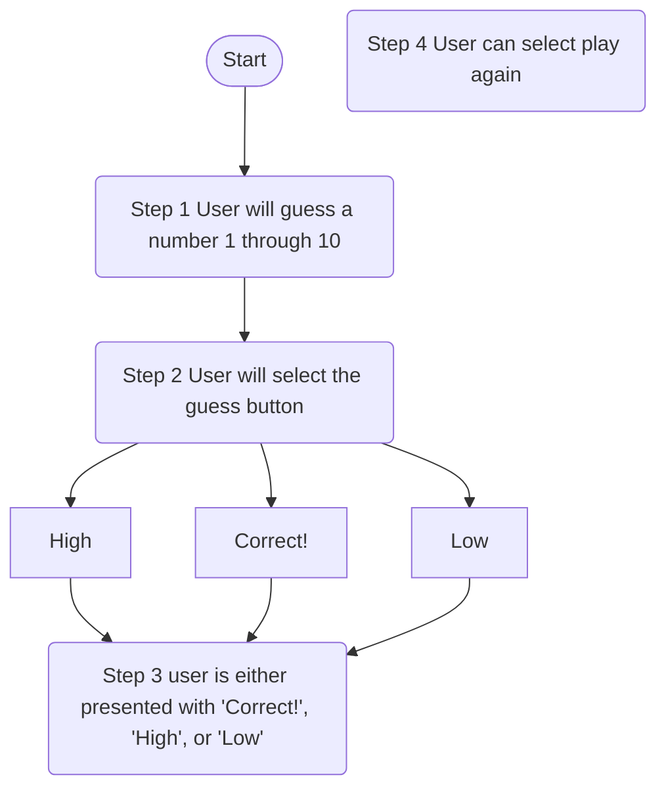

```mermaid
flowchart TD
 Start([Start]) --> id1([Guess a number 1 through 10]) --> id2([Player enters their number])
id2 --> High --> id3([Play Again])
id2 --> Correct! --> id3([Play Again])
id2 --> Low --> id3([Play Again])

Start([Start])
id1(Step 1 User will guess a number 1 through 10)
id2(Step 2 User will select the guess button)
id3(Step 3 user is either presented with 'Correct!', 'High', or 'Low')
id4(Step 4 User can select play again)

```