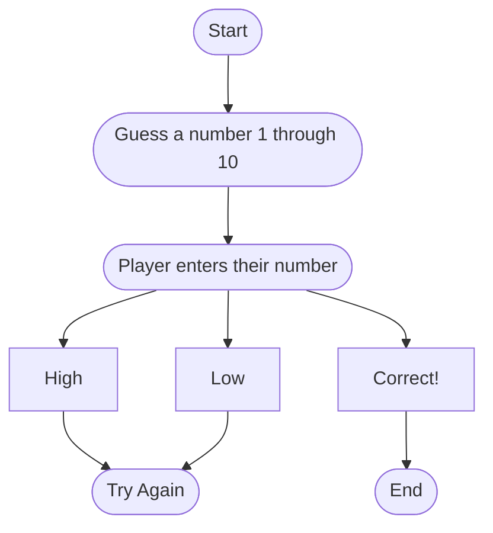

```mermaid
flowchart TD
 Start([Start]) --> id1([Guess a number 1 through 10]) --> id2([Player enters their number])
id2 --> High --> id3([Try Again])
id2 --> Correct! --> End([End])
id2 --> Low --> id3([Try Again])
```