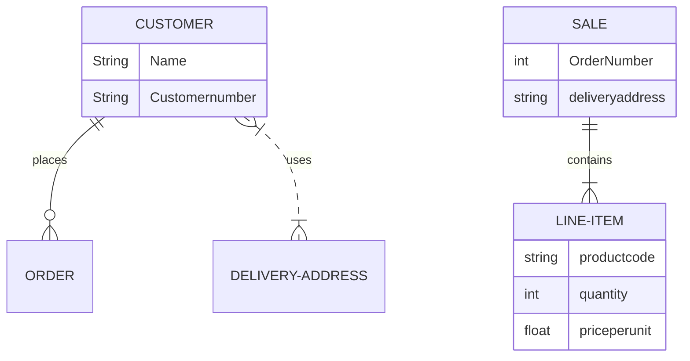

```mermaid
erDiagram
    CUSTOMER ||--o{ ORDER : places
    CUSTOMER {
           String Name
           String Customernumber
}
    SALE ||--|{ LINE-ITEM : contains
    SALE { 
       int OrderNumber
       string deliveryaddress
}
    CUSTOMER }|..|{ DELIVERY-ADDRESS : uses
    LINE-ITEM {
          string productcode
          int quantity
          float priceperunit
}

```