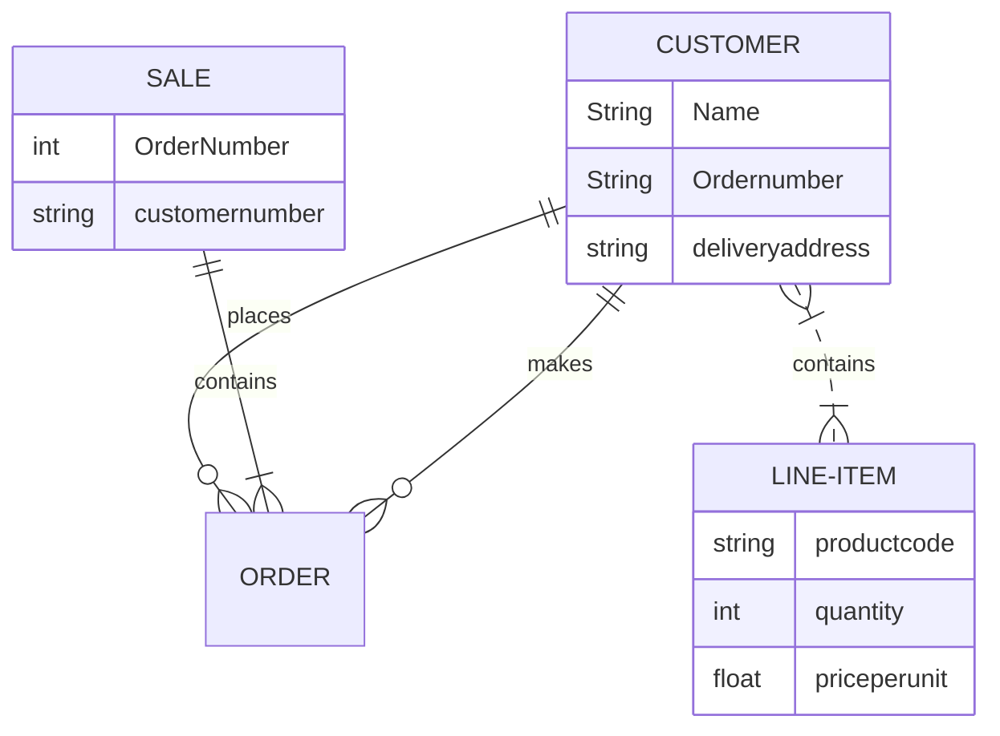

```mermaid
erDiagram
    CUSTOMER ||--o{ ORDER : places
    CUSTOMER {
           String Name
           String Ordernumber
           string deliveryaddress
}
    SALE ||--|{ ORDER : contains
    SALE { 
       int OrderNumber
       string customernumber
    }
    CUSTOMER }|..|{ LINE-ITEM : contains
    LINE-ITEM {
          string productcode
          int quantity
          float priceperunit
    }
CUSTOMER only one to zero or more ORDER : makes

```